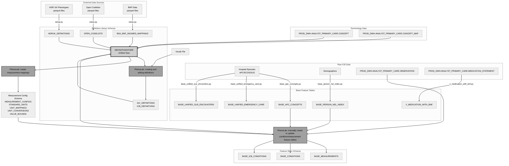

# DEPENDENCIES.md

Description of the PhenoLab data pipeline stages and the tables/columns required for each stage to function correctly.

## Data Flow and Table Relationships



## PhenoLab Pipeline Stages

The pipeline has five stages that transform raw clinical data into standardised features:

### 1. External Definition Loading
External clinical definitions fetched from public repositories via scripts in `_external_definitions/` and loaded into the definition library schema through `setup.py`.

### 2. Base Feature Creation
Raw ICB clinical data is transformed into standardised base feature tables using dedicated Python scripts in the `_base_features/` directory.

### 3. Definition Library Setup
The `setup.py` creates unified definition store and measurement configurations (hoovering up jsons).

### 4. Definition Management
PhenoLab users create and manage custom clinical definitions through the web interface. These are updated in jsons if working offline, or in `ICB_DEFINITIONS` if deployed ICB Snowflake accounts.

### 5. Feature Generation
Base features are combined with definitions and measurement configurations to generate analysis-ready condition and measurement tables. This is currently a manual trigger.

## Configuration Dependencies

### Configuration Files

Configuration files are stored in the `configs/` directory:

**Example Configuration (`configs/nel_icb_prod.yml`):**
```yaml
icb_name: NEL
definition_library:
  database: INTELLIGENCE_DEV
  schema: AI_CENTRE_DEFINITION_LIBRARY # contains definition tables (AIC_DEFINITIONS, ICB_DEFINITIONS, HDRUK_DEFINITIONS, etc.)
feature_store:
  database: INTELLIGENCE_DEV
  schema: AI_CENTRE_FEATURE_STORE #contains base feature tables created in set up process, and also condition and measurement tables produced in PhenoLab)
measurement_configs:
  database: INTELLIGENCE_DEV
  schema: AI_CENTRE_MEASUREMENT_CONFIGS # contains measurement configuration tables
gp_observation_table: PROD_DWH.ANALYST_PRIMARY_CARE.OBSERVATION # external dependency, not transformed to make suitable for phenolab
```

## Pipeline Stage Dependencies

### Stage 1: External Definition Loading

External definition sources are fetched and processed into parquet files, then loaded into database tables via `setup.py`.

**HDR UK Phenotypes (`_external_definitions/fetch_hdruk.py`)**
- Fetches phenotype definitions from HDR UK API
- Outputs: `hdruk_definitions.parquet`

**Open Codelists (`_external_definitions/fetch_open_codelists.py`)**
- Fetches codelists from opencodelists
- Outputs: `open_codelists_definitions.parquet`

**BNF Data (`_external_definitions/fetch_bnf.py`)**
- Processes BNF mappings
- Outputs: `processed_bnf_data.parquet`


### Stage 2: Base Feature Creation

ICB data transformed into standardised base feature tables using Python scripts in `_base_features/`.

#### BASE_APC_CONCEPTS (Created by `base_apc_concepts.py`)

Hospital episode concepts extracted from APC/ECDS/SUS data sources.

>| Column | Used by PhenoLab |
>|--------|:----------------:|
>| ATTENDANCE_ID | 0 |
>| PERSON_ID | 1 |
>| SK_PATIENTID | 0 |
>| ACTIVITY_DATE | 1 |
>| LENGTH_OF_STAY | 0 |
>| PROVIDER_NAME | 0 |
>| TREATMENT_SITE_NAME | 0 |
>| PATIENT_AGE | 1 |
>| CONCEPT_CODE | 0 |
>| CONCEPT_CODE_STD | 1 |
>| CONCEPT_NAME | 0 |
>| CONCEPT_TYPE | 0 |
>| VOCABULARY | 1 |
>| ADMISSION_METHOD | 0 |
>| DISCHARGE_DESTINATION | 0 |
>| MAIN_SPECIALTY | 0 |
>| SOURCE | 0 |

#### BASE_PERSON_NEL_INDEX (Created by `base_person_nel_index.py`)

Comprehensive patient demographics and registration information where each patient represented by last available entry.

>| Column | Used by PhenoLab |
>|--------|:----------------:|
>| PERSON_ID | 1 |
>| START_OF_MONTH | 0 |
>| END_OF_MONTH | 0 |
>| PRACTICE_CODE | 0 |
>| PRACTICE_NAME | 0 |
>| REGISTRATION_START_DATE | 0 |
>| REGISTRATION_END_DATE | 0 |
>| INCLUDE_IN_LIST_SIZE_FLAG | 0 |
>| GENDER | 1 |
>| ETHNICITY | 1 |
>| ETHNICITY_DETAIL | 0 |
>| ETHNICITY_MAIN_CATEGORY | 0 |
>| ETHNIC_AIC_CATEGORY | 0 |
>| PATIENT_LSOA_2011 | 0 |
>| PATIENT_LSOA_2021 | 0 |
>| IMD_DECILE | 1 |
>| IMD_QUINTILE | 0 |
>| DATE_OF_DEATH_PMI | 0 |
>| DATE_OF_DEATH_DATASET | 0 |
>| UPRN_SUGGESTS_LIVES_ALONE_FLAG | 0 |
>| SMOKING_STATUS | 0 |
>| LATEST_SMOKING_STATUS_DATE | 0 |
>| EVER_HOMELESS_FLAG | 0 |
>| HOUSEBOUND_FLAG | 0 |
>| HOUSEBOUND_TYPE | 0 |
>| LATEST_HOUSEBOUND_CODE_DATE | 0 |
>| DATE_OF_DEATH | 1 |
>| DATE_OF_BIRTH | 1 |
>| LONDON_IMD_RANK | 0 |
>| LONDON_IMD_DECILE | 0 |
>| IDAOP_LONDON_RANK | 0 |
>| IDAOP_LONDON_DECILE | 0 |
>| IDACI_LONDON_RANK | 0 |
>| IDACI_LONDON_DECILE | 0 |
>| EMPLOYMENT_LONDON_RANK | 0 |
>| EMPLOYMENT_LONDON_DECILE | 0 |
>| INCOME_LONDON_RANK | 0 |
>| INCOME_LONDON_DECILE | 0 |
>| EDU_LONDON_RANK | 0 |
>| EDU_LONDON_DECILE | 0 |
>| PATIENT_STATUS | 0 |

#### BASE_UNIFIED_EMERGENCY_CARE (Created by `base_unified_emergency_care.py`)

Emergency department attendance data.

>| Column | Used by PhenoLab |
>|--------|:----------------:|
>| ATTENDANCE_ID | 0 |
>| PERSON_ID | 1 |
>| SK_PATIENTID | 0 |
>| ACTIVITY_DATE | 1 |
>| ARRIVAL_MODE | 0 |
>| ATTENDANCE_SOURCE | 0 |
>| ADMITTED_TO_HOSPITAL | 0 |
>| ADMITTING_SERVICE | 0 |
>| FOLLOW_UP | 0 |
>| EMERGENCY_CARE_DISCHARGE_DESTINATION | 0 |
>| EMERGENCY_CARE_DISCHARGE_STATUS | 0 |
>| TIME_IN_DEPARTMENT_MINUTES | 0 |
>| TIME_TO_TREATMENT | 0 |
>| DEPARTMENT_TYPE | 0 |
>| TREATMENT_SITE_NAME | 0 |
>| PROVIDER_NAME | 0 |
>| PATIENT_AGE | 1 |
>| CONCEPT_CODE | 0 |
>| CONCEPT_CODE_STD | 1 |
>| CONCEPT_NAME | 0 |
>| CONCEPT_TYPE | 0 |
>| VOCABULARY | 1 |

#### BASE_UNIFIED_SUS_ENCOUNTERS (Created by `base_unified_sus_encounters.py`)

Hospital encounters with episode information.

>| Column | Used by PhenoLab |
>|--------|:----------------:|
>| ENCOUNTER_ID | 0 |
>| ENCOUNTER_TYPE | 0 |
>| PERSON_ID | 1 |
>| SK_PATIENTID | 0 |
>| ACTIVITY_DATE | 1 |
>| LENGTH_OF_STAY | 0 |
>| PROVIDER_CODE | 0 |
>| PROVIDER_NAME | 0 |
>| TREATMENT_SITE_CODE | 0 |
>| TREATMENT_SITE_NAME | 0 |
>| PATIENT_AGE | 1 |
>| TREATMENT_FUNCTION_CODE | 0 |
>| TREATMENT_FUNCTION_DESCRIPTION | 0 |
>| ADMISSION_METHOD | 0 |
>| ADMISSION_CATEGORY | 0 |
>| ARRIVAL_MODE | 0 |
>| DISCHARGE_DESTINATION | 0 |
>| MAIN_SPECIALTY | 0 |
>| HRG_CODE | 0 |
>| HRG_NAME | 0 |
>| TOTAL_ACTIVITY_COST | 0 |

#### V_MEDICATION_WITH_BNF (Created by `v_medication_with_bnf.py`)

Medication prescriptions with BNF therapeutic class mappings.

>| Column | Used by PhenoLab |
>|--------|:----------------:|
>| PERSON_ID | 1 |
>| CLINICAL_EFFECTIVE_DATE | 1 |
>| BNF_REFERENCE | 1 |
>| BNF_PARAGRAPH_CODE | 0 |
>| BNF_NAME | 1 |

#### Additional Views and Tables

The `base_unified_sus_encounters.py` script also creates five encounter-type-specific views:

- **BASE_ENCOUNTER_TYPE_AE_ARRIVAL**: A&E arrival method analysis
- **BASE_ENCOUNTER_TYPE_AE_HRG**: A&E HRG code analysis
- **BASE_ENCOUNTER_TYPE_OPD_FUNCTION**: Outpatient function analysis
- **BASE_ENCOUNTER_TYPE_INPT_LOS**: Inpatient length of stay analysis
- **BASE_ENCOUNTER_TYPE_INPT_METHOD**: Inpatient admission method analysis

### Stage 3: Definition Library Setup

The `setup.py` script creates definition tables and measurement config tables.

#### Required External Dependencies

These Primary Care tables must be accessible for definition code mapping.

>| PROD_DWH.ANALYST_PRIMARY_CARE.CONCEPT | Used by PhenoLab |
>|-----------------|:----------------:|
>| NAME | 1 |
>| CODE | 1 |
>| DBID | 1 |
>| SCHEME | 1 |
>| SCHEME_NAME | 1 |
>| MAPPING_TYPE | 1 |

>| PROD_DWH.ANALYST_PRIMARY_CARE.CONCEPT_MAP | Used by PhenoLab |
>|-----------------|:----------------:|
>| LEGACY | 1 |
>| CORE | 1 |

#### Definition Tables (Created by `setup.py`)

**AIC_DEFINITIONS**
AI Centre custom clinical definitions.

>| Column | Used by PhenoLab |
>|--------|:----------------:|
>| CODE | 1 |
>| CODE_DESCRIPTION | 1 |
>| VOCABULARY | 1 |
>| CODELIST_ID | 0 |
>| CODELIST_NAME | 0 |
>| CODELIST_VERSION | 1 |
>| DEFINITION_ID | 1 |
>| DEFINITION_NAME | 1 |
>| DEFINITION_VERSION | 1 |
>| DEFINITION_SOURCE | 1 |
>| VERSION_DATETIME | 1 |
>| UPLOADED_DATETIME | 0 |

**ICB_DEFINITIONS**
ICB-specific clinical definitions (same structure as AIC_DEFINITIONS) read/write when deployed to Snowflake.

**HDRUK_DEFINITIONS**
HDR UK phenotype definitions (same structure as AIC_DEFINITIONS).

**OPEN_CODELISTS**
Open codelists from various organisations (same structure as AIC_DEFINITIONS).

**BSA_BNF_SNOMED_MAPPINGS**
British National Formulary to SNOMED mappings.

>| Column | Used by PhenoLab |
>|--------|:----------------:|
>| BNF_CODE | 1 |
>| BNF_NAME | 1 |
>| SNOMED_CODE | 1 |
>| SNOMED_NAME | 1 |

**DEFINITIONSTORE (Unified View)**
Combines all definition sources with vocabulary mappings.

>| Column | Used by PhenoLab |
>|--------|:----------------:|
>| CODE | 1 |
>| CODE_DESCRIPTION | 1 |
>| VOCABULARY | 1 |
>| CODELIST_ID | 0 |
>| CODELIST_NAME | 0 |
>| CODELIST_VERSION | 1 |
>| DEFINITION_ID | 1 |
>| DEFINITION_NAME | 1 |
>| DEFINITION_VERSION | 1 |
>| DEFINITION_SOURCE | 1 |
>| VERSION_DATETIME | 1 |
>| UPLOADED_DATETIME | 0 |
>| SOURCE_TABLE | 1 |
>| DBID | 1 |
>| CORE_CONCEPT_ID | 1 |

#### Measurement Configuration Tables (Created by `setup.py`)

**MEASUREMENT_CONFIGS**
Configuration metadata for measurement definitions.

>| Column | Used by PhenoLab |
>|--------|:----------------:|
>| DEFINITION_ID | 1 |
>| DEFINITION_NAME | 1 |
>| CONFIG_ID | 1 |
>| CONFIG_VERSION | 1 |

**STANDARD_UNITS**
Standard unit definitions for measurements.

>| Column | Used by PhenoLab |
>|--------|:----------------:|
>| DEFINITION_ID | 1 |
>| DEFINITION_NAME | 1 |
>| CONFIG_ID | 1 |
>| CONFIG_VERSION | 1 |
>| UNIT | 1 |
>| PRIMARY_UNIT | 1 |

**UNIT_MAPPINGS**
Mappings from source units to standard units.

>| Column | Used by PhenoLab |
>|--------|:----------------:|
>| DEFINITION_ID | 1 |
>| DEFINITION_NAME | 1 |
>| CONFIG_ID | 1 |
>| CONFIG_VERSION | 1 |
>| SOURCE_UNIT | 1 |
>| STANDARD_UNIT | 1 |
>| SOURCE_UNIT_COUNT | 1 |
>| SOURCE_UNIT_LQ | 1 |
>| SOURCE_UNIT_MEDIAN | 1 |
>| SOURCE_UNIT_UQ | 1 |

**UNIT_CONVERSIONS**
Conversion formulas between units.

>| Column | Used by PhenoLab |
>|--------|:----------------:|
>| DEFINITION_ID | 1 |
>| DEFINITION_NAME | 1 |
>| CONFIG_ID | 1 |
>| CONFIG_VERSION | 1 |
>| CONVERT_FROM_UNIT | 1 |
>| CONVERT_TO_UNIT | 1 |
>| PRE_OFFSET | 1 |
>| MULTIPLY_BY | 1 |
>| POST_OFFSET | 1 |

**VALUE_BOUNDS**
Acceptable value ranges for measurements.

>| Column | Used by PhenoLab |
>|--------|:----------------:|
>| DEFINITION_ID | 1 |
>| DEFINITION_NAME | 1 |
>| CONFIG_ID | 1 |
>| CONFIG_VERSION | 1 |
>| LOWER_LIMIT | 1 |
>| UPPER_LIMIT | 1 |

### Stage 4: Definition Management (PhenoLab Interface)

Users create and manage clinical definitions

#### Required External Data

**PROD_DWH.ANALYST_PRIMARY_CARE.OBSERVATION**
Primary care observation data used for measurement standardisation.

>| Column | Used by PhenoLab |
>|--------|:----------------:|
>| ID | 1 |
>| PERSON_ID | 1 |
>| CORE_CONCEPT_ID | 1 |
>| CLINICAL_EFFECTIVE_DATE | 1 |
>| AGE_AT_EVENT | 1 |
>| RESULT_VALUE | 1 |
>| RESULT_VALUE_UNITS | 1 |

### Stage 5: Feature Generation (PhenoLab Interface)

Condition and measurement feature table updates are triggered manually.

#### Generated Feature Tables

**BASE_MEASUREMENTS**
Standardized measurement data with unit conversions and validation.

>| Column | Used by PhenoLab |
>|--------|:----------------:|
>| PERSON_ID | 1 |
>| CLINICAL_EFFECTIVE_DATE | 1 |
>| AGE_AT_EVENT | 1 |
>| DEFINITION_ID | 1 |
>| DEFINITION_NAME | 1 |
>| DEFINITION_VERSION | 1 |
>| VERSION_DATETIME | 1 |
>| SOURCE_RESULT_VALUE | 1 |
>| SOURCE_RESULT_VALUE_UNITS | 1 |
>| VALUE_AS_NUMBER | 1 |
>| VALUE_UNITS | 1 |
>| ABOVE_RANGE | 1 |
>| BELOW_RANGE | 1 |

**BASE_CONDITIONS**
Condition flags based on AIC definition matches.

>| Column | Used by PhenoLab |
>|--------|:----------------:|
>| PERSON_ID | 1 |
>| ACTIVITY_DATE | 1 |
>| AGE_AT_EVENT | 1 |
>| DEFINITION_ID | 1 |
>| DEFINITION_NAME | 1 |
>| DEFINITION_VERSION | 1 |
>| VERSION_DATETIME | 1 |
>| VOCABULARY | 1 |
>| CODE | 1 |
>| CODE_DESCRIPTION | 1 |

**BASE_ICB_CONDITIONS**
Condition flags based on ICB-specific definition matches (same structure as BASE_CONDITIONS).