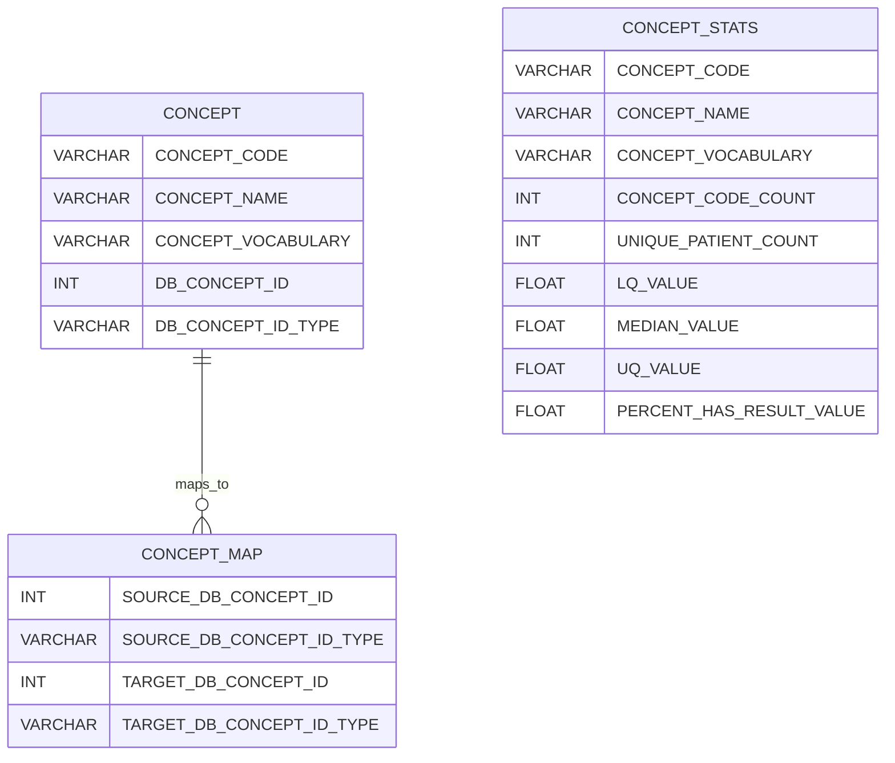
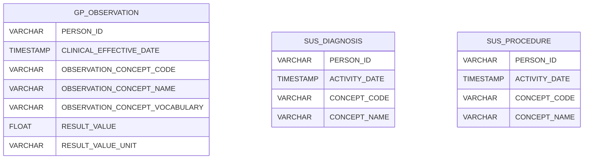

# Deployment

Superusers only. Changes to external definitions, AI Centre definitions, and measurement configurations, are treated as software releases that are redeployed into end-user Snowflake environments.

## 1. External Definitions

Required definitions must be configured and loaded to local files.

```bash
cd extdefinitions
./update.sh  # Updates all sources
# Or update specific sources:
./update.sh --hdruk --opencodelists --nhs-snomed
# Saves as parquet files locally
```

## 2. Snowflake Configuration

Ensure connection configured in `~/.snowflake/connections.toml`

```yaml
[connections.nel_icb]
account = "ATKJNCU-NEL_ICB"
user = "user@email.net"
database = "DATABASE"
authenticator = "externalbrowser"
schema = "SCHEMA"
warehouse = "WAREHOUSE"
role = "ROLE"
```

## 3. Required Tables

The following tables must exist in Snowflake for PhenoLab to function correctly. If deploying PhenoLab together with the AI Centre dbt pipeline, these tables will be created automatically.

**Vocabulary/Concept Tables**


**Clinical Data Tables**


The deployment process creates these tables that are used by PhenoLab:

**Definition Library Tables**
- `AIC_DEFINITIONS` - Created from local JSON files in `data/definitions/`
- `ICB_DEFINITIONS` - Created as empty table (but preserves user data across deployments)
- `HDRUK_DEFINITIONS` - Created from `extdefinitions/hdruk/hdruk_definitions.parquet`
- `OPENCODELISTS` - Created from `extdefinitions/opencodelists/opencodelists_definitions.parquet`
- `NHS_SNOMED_REFSETS` - Created from `extdefinitions/ontoserver/nhs_snomed_refset_definitions.parquet`

**Definition Views**
- `DEFINITIONSTORE` - Unified view combining all definition tables

**Measurement Configuration Tables**
- `MEASUREMENT_CONFIGS` - Created from local JSON files in `data/measurements/`
- `STANDARD_UNITS` - Unit definitions for measurement standardisation
- `UNIT_MAPPINGS` - Source to standard unit mappings
- `UNIT_CONVERSIONS` - Conversion formulas between units
- `VALUE_BOUNDS` - Acceptable value ranges for measurements


## 4. ICB Configuration

Each ICB requires configuration files in the `/configs` directory that specify:
- Snowflake warehouse, database, and schema settings
- References to the ICB's existing data tables (observations, concepts, SUS data)
- Where PhenoLab should create its definition and measurement tables

Each ICB requires dev and prod configuration files:
- `<icb>_icb_prod.yml` - Production configuration
- `<icb>_icb_dev.yml` - Development/testing configuration

The example below shows `sel_icb_dev.yml`:

```yaml
icb_name: SEL
deployment:
  warehouse: SEL_AICENTRE_XS
  database: DATA_LAB_AI_CENTRE
  schema: PHENOLAB_DEV
  app_title: PhenoLab_dev
definition_library:
  database: DATA_LAB_AI_CENTRE
  schema: PHENOLAB_DEV
feature_store:
  database: DATA_LAB_AI_CENTRE
  schema: PHENOLAB_DEV
measurement_configs:
  database: DATA_LAB_AI_CENTRE
  schema: PHENOLAB_DEV
gp_observation_table: DATA_LAB_AI_CENTRE.DBT_DEV.STG_GP__OBSERVATION
gp_concept_table: DATA_LAB_AI_CENTRE.DBT_DEV.STG_GP__CONCEPT
gp_concept_map_table: DATA_LAB_AI_CENTRE.DBT_DEV.STG_GP__CONCEPT_MAP
vocabulary_table: DATA_LAB_AI_CENTRE.DBT_DEV.STG_CONCEPT__STATS
sus_icd10_table: DATA_LAB_AI_CENTRE.DBT_DEV.STG_SUS__APC_DIAGNOSIS_ICD10
sus_opcs4_table: DATA_LAB_AI_CENTRE.DBT_DEV.STG_SUS__APC_PROCEDURE_OPCS4
```

Each ICB also requires a line in `configs/account_mapping.yml` to map Snowflake account IDs to ICB prefixes.

## 5. Deploy to Snowflake

Take the following steps to deploy PhenoLab to run within a Snowflake environment:

```bash
# Make script executable (first time only)
chmod +x deploy.sh

# Deploy to development first (recommended)
./deploy.sh <ICB> dev

# Deploy to production after testing only
./deploy.sh <ICB> prod

# Examples:
./deploy.sh sel dev     # SEL ICB development
./deploy.sh sel prod    # SEL ICB production
```

The `deploy.sh` script does the following:

1. Checks that `configs/<icb>_icb_<env>.yml` exists
2. Creates deployment-specific `snowflake.yml`
3. Ensures target database schema exists
4. Uploads application to Snowflake using `snow streamlit deploy`
5. Runs `setup.py` to:
   - Create definition tables (`AIC_DEFINITIONS`, `ICB_DEFINITIONS`)
   - Load external definitions (HDR UK, OpenCodelists, NHS SNOMED)
    - Note that these are defined in `external_definitions.yml`
   - Create measurement configuration tables
   - Build `DEFINITIONSTORE` unified view