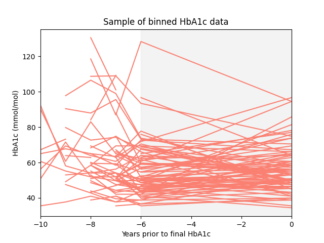
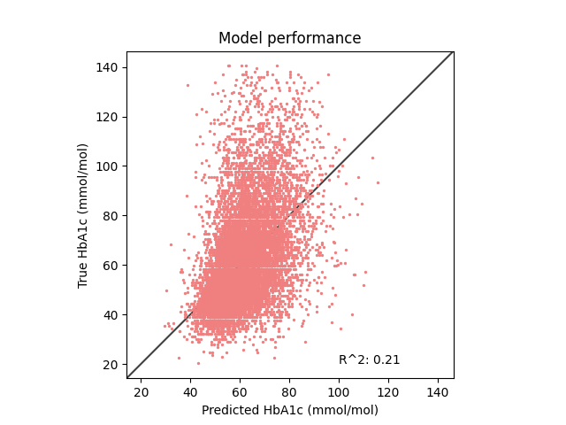

# Experiments in predicting risk of progression in patients with diabetes

## Experiment 1: Using XGBoost to predict future HbA1c

Data:
- Patients coded as having non-T1 diabetes, who also have HbA1c data
- HbA1c assumed to be % if between 4 and 15, or mmol/mol if between 19 and 140. All values then converted to mmol/mol
- The final HbA1c for any given patient was used as the outcome variable.
- All HbA1cs in the 5 years prior to the outcome variable were discarded
- In the 5 years prior to this, HbA1c was averaged by year so there were annual HbA1cs from 6 to 10 years prior to the time of the outcome HbA1c
- The input variables were average yearly annual HbA1c for years -10 to -6, gender, ethnicity and age at the end of the observation period
- All data currently available used (n ~= 62,000)

Model:
- XGBoost Regression
- NB very sparse data with lots of missing values - XGBoost handles natively

Results:

To Do:
- This is quite a challenging task as the blinded period prior to the outcome HbA1c is long (5 years). Try with shorter outcome periods
- Incorporate further predictor variables e.g. medication use, smoking status
- Bin patients into low/medium/high HbA1c and evaluate performance that way

## To do

- complications
- death??
- look again at ethnicity
- BMI
- renal function
- smoking
- alcohol use
- medications
- plotting!! (also the other vars)
